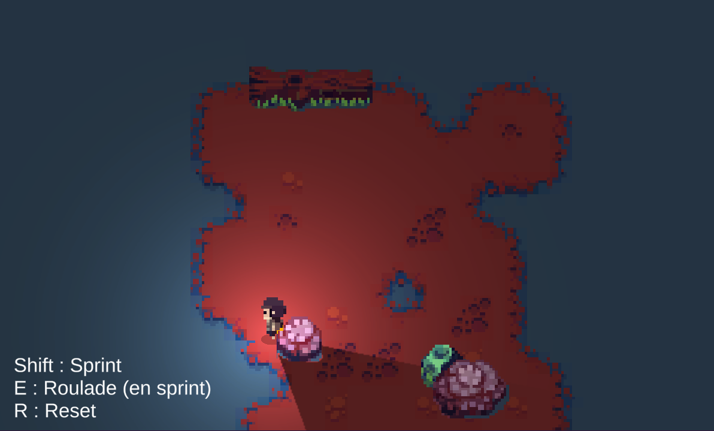
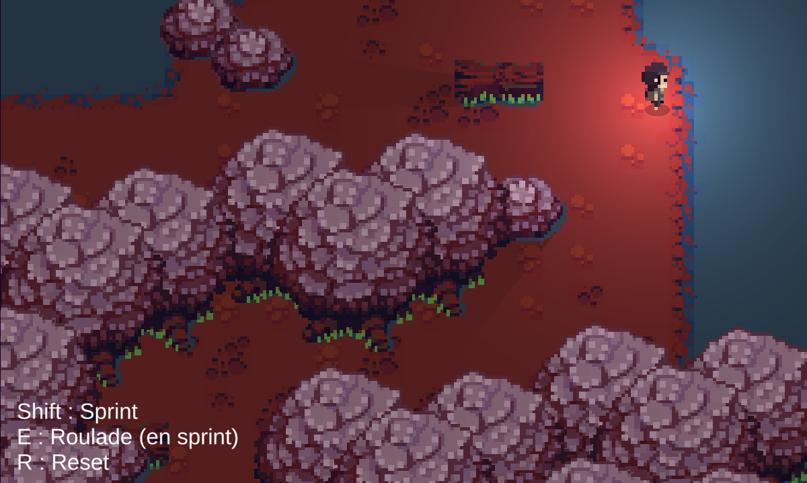
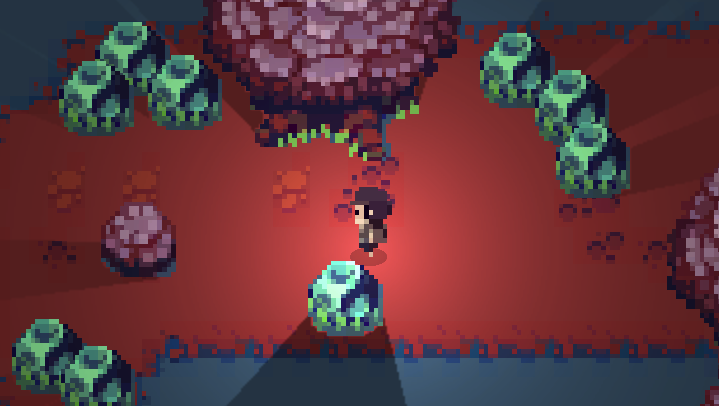
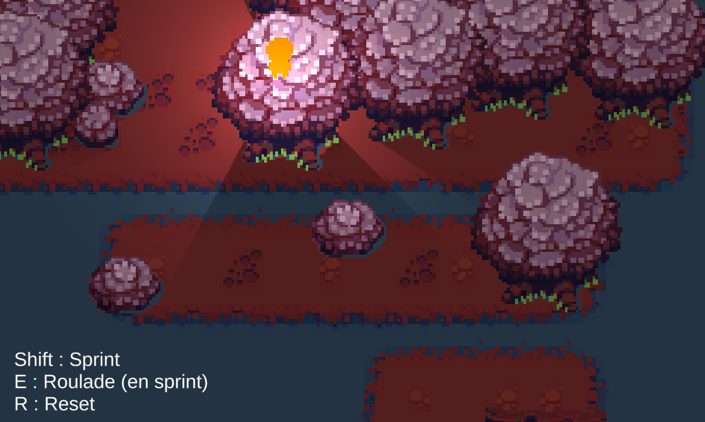
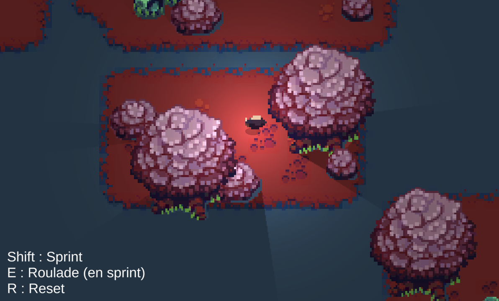
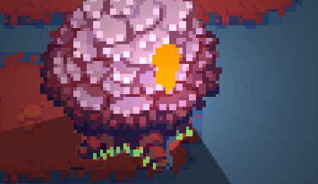

# Titan Souls-Like

 
  &nbsp
  &nbsp
  &nbsp
  &nbsp
  &nbsp
  

<a href="https://archer01.itch.io/titans-souls"># (Play game)</a>&nbsp;

---

## Résumé
Un exercice d'un top down 2D comme Titan Souls

---

## Liens
  * <a href="https://www.youtube.com/channel/UCwxuydeEi6WyM-X6nsPs-8A">Youtube</a>
  * <a href="https://archer01.itch.io/">Itch.io</a>
  * <a href="https://hashnode.com/@Archer01">Hashnode (Dev Blog)</a>
  * <a href="https://www.linkedin.com/in/julienguenard/">Linkedin</a>
  * <a href="https://twitter.com/julien_guenard">Twitter</a>
